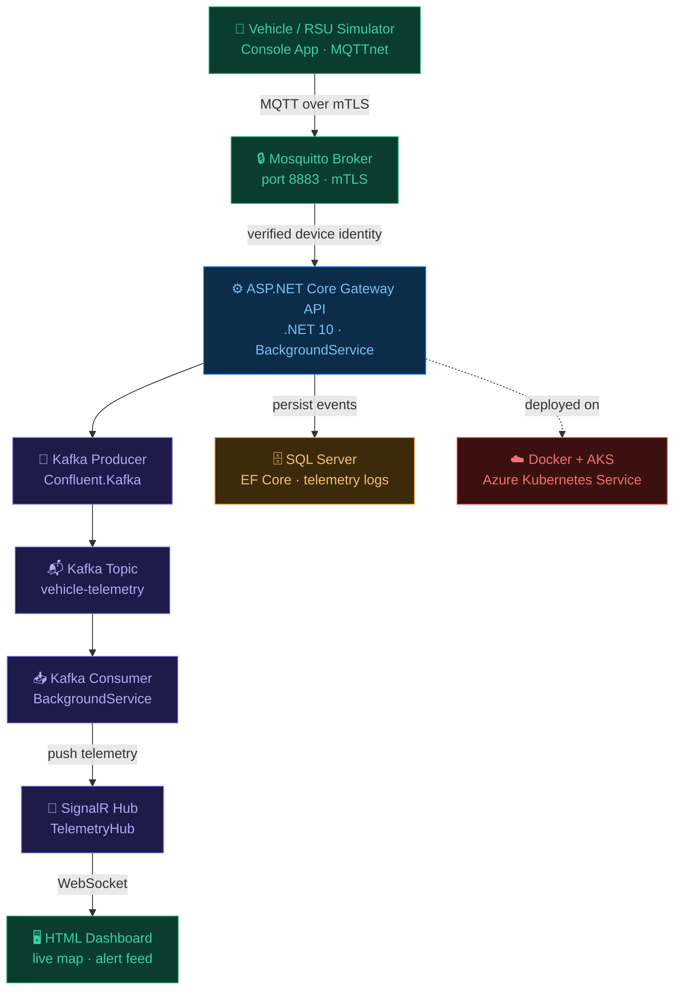

# VehicleLink Gateway
Real time V2X communication gateway MQTT over mTLS → Kafka → SignalR → HTML Dashboard. Built with ASP.NET Core 10.0
## Overview
VehicleLink Gateway is a real time Vehicle-to-Everything (V2X) communication 
gateway built with ASP.NET Core 10.0. It ingests telemetry from vehicles and 
roadside units over MQTT with mutual TLS authentication, streams events through 
Apache Kafka, and broadcasts safety critical alerts to a live HTML operator 
dashboard via SignalR WebSocket all deployable on Docker and Azure Kubernetes 
Service (AKS).

The project addresses core challenges in modern V2X infrastructure:
- **Secure device identity**  only certificate-verified devices can publish (mTLS)
- **High-throughput ingestion**  decoupled event pipeline via Kafka
- **Real-time operator visibility**  sub second push to connected clients via SignalR
- **Cloud-native scale**  containerised with Docker, deployable to AKS with 2+ replicas

## Tech Stack

| Layer | Technology |
|---|---|
| Gateway API | ASP.NET Core 10.0, C# |
| Secure messaging | MQTT (MQTTnet), mTLS, OpenSSL |
| Event streaming | Apache Kafka (Confluent.Kafka) |
| Real-time push | SignalR |
| Persistence | EF Core, SQL Server |
| Frontend | HTML, @microsoft/signalr |
| Deployment | Docker, Azure Kubernetes Service (AKS) |

## Architecture

## Live Demo

> Real-time V2X telemetry from 3 vehicles flowing through 
> MQTT over mTLS → Kafka → SignalR → operator dashboard.
> EMERGENCY events trigger live alerts with visual indicators.
